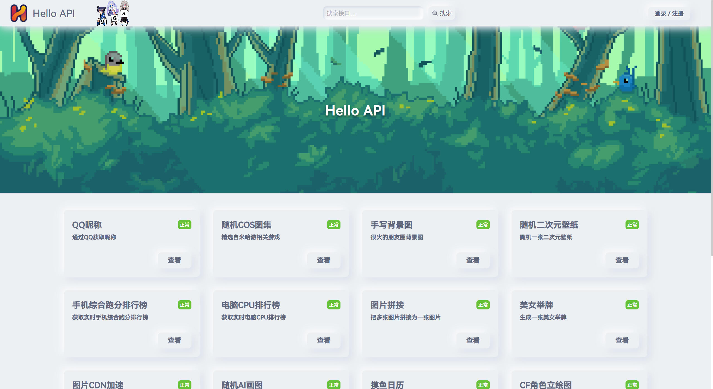
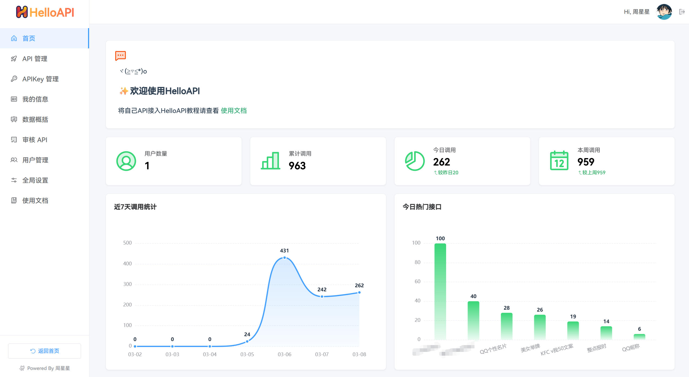

<h1 align="center">

  

HelloAPI

[](../../releases/latest)

</h1>

## 简介

采用拟态风格，简约的API管理程序

- 支持正常、维护、未公开、收费、隐藏等状态
- 自适应移动端、PC端
- 支持用户注册，可自定义全局设置
- 支持审核API接口
- 数据统计

## 技术栈

- Spring Boot 4
- Vue 3 + Vite

## 系统要求

- Java 21+
- MySQL 5.7+

## 截图





## Demo演示站

https://api.zxz.ee

## 部署

### 后端

- 目录：`server`
- 配置文件：`server/src/main/resources/application.yml`
- 配置好后编译即可，或者将配置文件复制到编译好之后的同级目录，在外部进行配置文件修改
- 不想自己编译？
    - 直接前往 [releases](../../releases/latest) 下载编译好的

### 前端

- 目录 `web`
  ```
  cd web
  ```
- 修改配置文件 `web/src/config/config.ts`
- 下载依赖 `pnpm i`
- 直接运行 `pnpm dev`
- 编译/打包 `pnpm build`
- 伪静态 Nginx
  ```
    location / {
    try_files $uri $uri/ /index.html;
    }
    ```

## 部署视频教程

。。。等我录制
